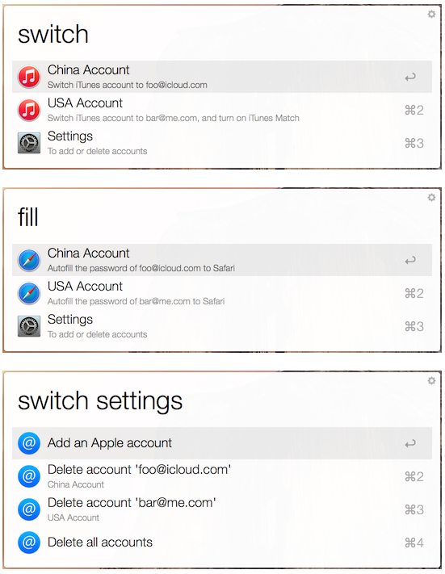
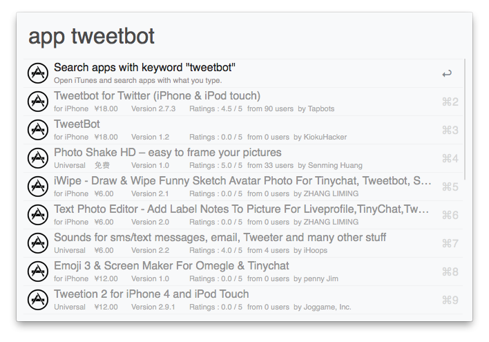
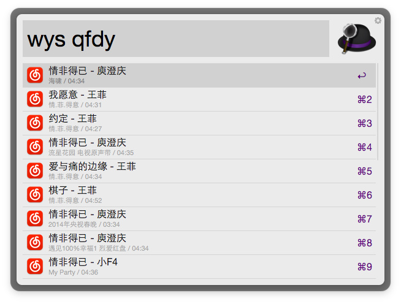

# Alfred
> 把自己在用的Alfred的一些自定义功能、Workflow结合自己的实际用途记录在这里，欢迎交流。
> Alfred V3快发布了，期待！

# Web Search（自定义）
- Baidu：`http://www.baidu.com/s?wd={query}`
- 淘宝：`http://s.taobao.com/search?q={query}`
- 京东：`http://search.jd.com/Search?keyword={query}`
- 知乎：`http://www.zhihu.com/search?q={query}&type1=all`
- 微博：`http://s.weibo.com/weibo/{query}`
- 高德：`http://gaode.com/search?query={query}`
- iTunes（客户端）：`itunes://ax.search.itunes.apple.com/WebObjects/MZSearch.woa/wa/search?term={query}`
- AppShopper：`http://appshopper.com/search?search={query}`
- 网易云音乐：`http://music.163.com/#/search/m/?s={query}`
- 虾米：`http://www.xiami.com/search?key={query}`

# Workflow
##Apple Account Switcher
- 作者：[@summxt](http://www.alfredforum.com/topic/3939-apple-account-switcher/)
- 因为自己有两个Apple ID，一个中区，一个美区，主力中区，美区的主要用于下载一些中区没有上架的应用，可使用此workflow快速切换iTunes Store、App Store的Apple ID，也可以快速填充Apple ID的密码。
- 作者最新更新的版本是1.5，因为在10.11系统中似乎有些bug导致不能使用，根据网上查的资料，做了一下修改。

 
## 人民币金额大写
- 作者：[@yoution](https://github.com/yourtion/Alfred_NumToCny)
- 报销时，需要在报销单时报销金额的大写数字，很头疼，这个workflow通过输入数字直接显示对应大写数字。

##App Store搜索
- 作者：[@yisiqi](https://github.com/yisiqi/alfred2-workflow-appstore)
- 快速搜索iTunes Store 和 App Store 中的应用，显示基本应用信息，可跳转至应用详情页。

##网易云音乐搜索
- 作者：[@goodbest](https://www.v2ex.com/t/161258)
- 快速搜索网易云音乐中的歌曲、专辑、歌手等。

专门写了一篇文章介绍我的 Alfred 用法，[戳这里查看](http://chuxiangyuan.github.io/14774965258076.html)。

以后可能还会不定期的在这里分享用到的 workflow，待续...

